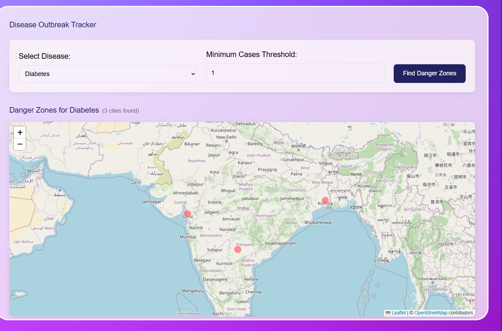

# 🧠 Smart Symptom Analyzer

## 📝 Description

**Smart Symptom Analyzer** is a full-stack web application that allows users to log in and predict the likelihood of four major diseases:

- **Diabetes**
- **Heart Disease**
- **Parkinson’s Disease**
- **Breast Cancer**

Upon prediction, the location of the detected disease is marked on a map, visualizing regional health trends.

---

## 🗺️ Disease Outbreak Map Feature

Below is an example of how the app visualizes danger zones for diseases based on user predictions:



---

## 🚀 How to Run the Project

### 1. Run the ML FastAPI Backend

```bash
cd ml
pip install -r requirements.txt  # Install Python dependencies
python -m uvicorn main:app --reload  # Start FastAPI server
```

### 2. Run the Node.js Backend

Open a new terminal:

```bash
cd backend
```

Create a `.env` file in the `backend/` directory with the following:

```
MONGODB_URI=<Your MongoDB URI>
PORT=5000
GOOGLE_MAPS_API_KEY=<Your Google Maps API Key>
```

Then run:

```bash
npm install
npm start  # Or: npm start
```

### 3. Run the React Frontend

```bash
cd frontend
```

Create a `.env` file in the `frontend/` directory with the following:

```
VITE_GOOGLE_MAPS_API_KEY=<Your Google Maps API Key>
VITE_GOOGLE_API_KEY=<Your Google API Key>
VITE_BACKEND_URI=http://localhost:5000
```

Then run:

```bash
npm install
npm run dev  # Or: npm start
```

---

## 🧰 Tech Stack

* **Frontend:** React + Vite, Tailwind CSS
* **Backend:** Express.js, Node.js, MongoDB
* **ML API:** FastAPI (Python)
* **ML Libraries:** scikit-learn, XGBoost
* **Visualization:** Google Maps API

---

## 🧪 ML Model Details

### Datasets

| Disease       | Instances | Features | Example Features           |
| ------------- | --------- | -------- | -------------------------- |
| Diabetes      | 768       | 8        | Glucose, BP, Insulin       |
| Heart Disease | 1025      | 14       | Age, Sex, Chest Pain       |
| Parkinson’s   | 195       | 22       | Frequency, Jitter, Shimmer |
| Breast Cancer | 569       | 30       | Radius, Texture, Area      |

### Model Development Pipeline

1. **Exploratory Data Analysis (EDA)**
2. **Data Preprocessing**

   * Handling missing values & outliers
   * Label/One-hot encoding
   * Feature scaling
3. **Model Selection**

   * Evaluated 5 classifiers
   * Selected top 3 via cross-validation
4. **Final Model Building**

   * Recursive Feature Elimination (RFE)
   * Hyperparameter tuning (GridSearchCV)
   * Classification Report Evaluation

---

## 📊 Model Performance

| Disease           | Model               | Accuracy |
| ----------------- | ------------------- | -------- |
| **Diabetes**      | Random Forest       | 75.32%   |
|                   | Logistic Regression | 70.13%   |
|                   | SVC                 | 69.48%   |
| **Heart**         | XGBoost             | 100%     |
|                   | Random Forest       | 100%     |
|                   | Logistic Regression | 88.31%   |
| **Parkinson**     | KNN                 | 100%     |
|                   | Random Forest       | 94.87%   |
|                   | XGBoost             | 92.31%   |
| **Breast Cancer** | Logistic Regression | 97.37%   |
|                   | XGBoost             | 97.37%   |
|                   | KNN                 | 96.49%   |

---

## 📍 Features

* User authentication
* Interactive UI with Vite + Tailwind CSS
* Real-time disease predictions
* Visualization of disease cases on Google Maps
* RESTful architecture with ML integration
---

     
